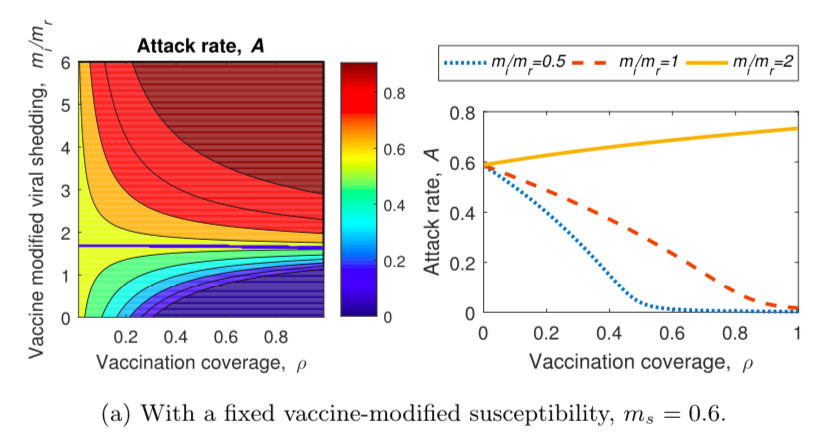
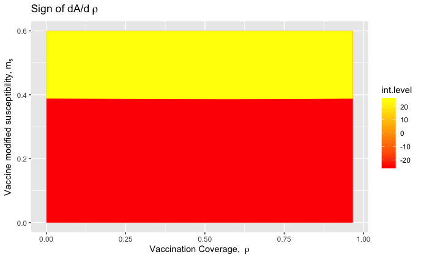

```{r setup, include=FALSE}
knitr::opts_chunk$set(echo = FALSE, message = FALSE, warning = FALSE)
```


### Summary of the paper 
For my remodeling project, I recreated the work of a 2020 paper titled “Impact of influenza vaccine-modified infectivity on attack rate, case fatality ratio and mortality” by Nah et al. This paper explores the potential impacts of vaccination on a hypothetical influenza outbreak. It is well understood that vaccination typically decreases susceptibility and reduces the infectious period (leading to a faster recovery rate). However, the authors also take into consideration recent work that has observed that vaccination may increase viral shedding and therefore transmission in vaccinated yet infected individuals. They model how vaccine-modified effects (susceptibility, infectivity, and recovery) can change the result of an outbreak. The authors used an SIRV model, an extension of an SIR model, in order to determine the impact of vaccination on the outcomes of a hypothetical influenza outbreak.  

The study examined the possible outcomes of the outbreak based on various vaccination characteristics. This involved varying both the vaccine coverage and vaccine-modified effects and then calculating measures indicative of the severity of the outbreak (including the attack rate, final size, case fatality ratio, and death rate). This study was therefore able to predict the outcomes for a wide variety of scenarios with different combinations of levels of vaccine coverage and vaccine-modified effects. These scenarios were visualized through a variety of figures displaying the outcomes for different combinations of varying parameter values.


The main finding of the study was that vaccination with a strong vaccine had a positive effect in reducing the severity of the epidemic, even with increased viral shedding in vaccinated individuals. Specifically, based on the results of their model, vaccination usually reduced the attack rate and final size for the epidemic, so vaccination still seemed to be found to be productive despite vaccine-modified effects that could increase viral shedding. Death rate and case fatality ratio also generally decreased as vaccination coverage increased, except when vaccine-modified susceptibility was low and vaccination coverage was high, this could lead to lower deaths but a higher case fatality ratio. 


### Description of the model
**Model:** This paper used an SIRV model to model the hypothetical influenza outbreaks. This is an extension of an SIR model, which is a compartmental model that uses ordinary differential equations to show the flow of individuals between different groups (from those who are susceptible to the disease, to those who are infected, then to those who recover from a disease). The SIRV model adds classes of susceptible vaccinated (V) and infected vaccinated (I<sub>v</sub>), in addition to the usual susceptible (S), infected (I), and recovered (R) population groups of an SIR model. Therefore, it incorporates vaccine-modified effects by including vaccine-modified infectivity (m<sub>i</sub>), vaccine-modified susceptibility (m<sub>s</sub>), vaccine-modified recovery (m<sub>r</sub>), and vaccine-modified mortality (m<sub>d</sub>). The SIRV model uses differential equations in order to relate continuous rates of change of these population classes to the biological processes of disease transmission, as shown in the model equations below:


**Conditions:** The authors of the paper assume the basic reproduction number, R<sub>0</sub>, to be set at a value of 1.5 for all of their model runs (except for the Figure 1). The initial population size, N<sub>0</sub> which is used to set the inital age classes in order to solve the model equations, is set at 1000 for all of the model runs. 

**Parameters:** Throughout their analysis, the authors of the paper generally maintain the same values for the base parameters of their model which includes the recovery rate ($\gamma$), disease-induced mortality ($\delta$), and baseline transmission rate ($\beta$). They then vary the effect of the vaccine on the population by changing the values for vaccination coverage ($\rho$), vaccine-modified susceptibility (m<sub>s</sub>), vaccine-modified infectivity (m<sub>i</sub>), and vaccine-modified recovery (m<sub>r</sub>). 

**Values of parameters:** The authors of the paper determine parameter values from the literature. For most of their model runs, they use a recovery rate ($\gamma$) = 1x10<sup>-3</sup> and disease-induced mortality ($\delta$) = 1x10<sup>-3</sup> or 0. Baseline transmission rate ($\beta$) is estimated using the values for R<sub>0</sub>, $\delta$, $\gamma$, and N<sub>0</sub>, calculated using the equation $\beta= R_0(\delta\gamma/N_0)$. They vary the vaccine-modified parameters over a range of values, with vaccine coverage ($\rho$) = [0, 1], vaccine-modified susceptibility (m<sub>s</sub>) = [0, 0.6], vaccine-modified infectivity (m<sub>i</sub>) = [0, 6], and vaccine-modified recovery (m<sub>r</sub>) is less than or equal to 1. 

**Outputs:** By varying combinations of these parameters, the study observes how vaccination affects the outcomes of the outbreak. Using the SIRV model, the focus of the paper was to understand the outcomes and characterize hypothetical outbreaks with different vaccination conditions, which is accomplished by calculating measures from the model output that represent the outcome of the epidemic (final size, attack rate, case fatality ratio and death rate). The final size is the total number of infections over the epidemic, which is also recorded for vaccinated (F<sub>v</sub>) and non-vaccinated (F<sub>n</sub>) individuals. The attack rate is the proportion of the population that experiences infection over the period of the epidemic, which is the sum of the attack rate for vaccinated individuals (A<sub>v</sub>) and the attack rate for non-vaccinated individuals (A<sub>n</sub>). A successful vaccination reduces the overall attack rate. The case fatality ratio (CFR) is defined as the ratio of deaths occurring from an influenza infection to the total number of cases. The final measure is the death rate per 100,000 population. 

### Methods
**Reproducing the model:**
I was able to reproduce the paper’s SIRV model by starting with the SIR model we learned in class and building off of it to add the additional classes of susceptible but vaccinated individuals (V) and infected but vaccinated individuals (I<sub>v</sub>). I was also then able to easily include the vaccine modified effect parameters (m<sub>i</sub>, m<sub>s</sub>, m<sub>r</sub>, m<sub>d</sub>), as determined by the equations given in the SIRV model. I set the initial sizes for each of the population groups (S, V, I, I<sub>v</sub>) using equations given in the paper, and assumed the initial size of the recovered population to be zero. I set up the model by creating a function in R for the SIRV equations and ran the function using the ode() function (using the deSolve package) to solve the ordinary differential equations and calculate the relevant output values. 

**Reproducing the figures:** 
In order to reproduce most of the figures, I looped over the model in order to vary multiple parameters simultaneously. Most of the figures required a range of vaccination coverage ($\rho$) values from 0 to 1 plotted on the x-axis, for multiple different values, or a range of values, of one of the other vaccine-modified effects (m<sub>i</sub>, m<sub>s</sub>, m<sub>r</sub>). Based on these parameter inputs, the figures required the calculation of one of the output measures (eg. final size, attack rate, CFR, death rate). I saved the output values for each iteration of the loop in a vector to use for the plots. 

**Running the model:**
I ran the model with the initial number of infections set at 20 individuals (this was not specified by the paper but was the number I found to best reproduce the figures). This information was fed into the model in order to calculate the initial population sizes for the infected non-vaccinated (I) and infected vaccinated (I<sub>v</sub>) classes, based on the value of vaccination coverage for the population ($\rho$). I ran the model for a time period of at least 100 days, finding that the epidemic seemed to have run its course after this amount of time. One hundred days was sufficient to successfully recreate Figures 2, 3, 5, 10, and 11 (although running the model for 200 days also worked for these figures), but 200 days were required to successfully reproduce Figure 7. For the figures involving the vaccine-modified viral shedding, m<sub>i</sub>/m<sub>r</sub> ratio, I typically set m<sub>r</sub> at 1 and varied m<sub>i</sub> in order to vary the m<sub>i</sub>/m<sub>r</sub> ratio. Overall, I was successful in recreating the figures accurately, although there were some discrepancies between my recreated figures and the original paper. 


### Figure-by-figure breakdown


#### Figure 1
 

Figure 1: Relationship between vaccine-modified effects and the epidemic threshold (left panel, Nah et al. 2020; right panel recreated)

I found the value of the epidemic threshold based off of varying values of ρ and R<sub>0</sub>, and changing m<sub>s</sub> and m<sub>i</sub>/m<sub>r</sub>. The epidemic threshold is calculated by $(1 + (1 - R_0) / (ρR_0)$

Methods: For Figure 1, I actually did not use the full model, but instead used the following equation:
$R_v = (1-ρ)R_0 + ((mi*ms)/mr)ρR_0$

I then rearranged this equation for R<sub>0</sub> and plugged in varying values for ρ, m<sub>s</sub>, and m<sub>i</sub>/m<sub>r</sub>. My recreation of Figure 1 does noticeably differ from the study, and I was not able to recreate the figure more accurately using the equations given. However, this should not have an impact on the remainder of my results because the calculations involved for Figure 1 were isolated from the model, which I used for the remainder of the figures. 

Results: Maintaining R<sub>v</sub> < 1 requires a higher vaccine-modified susceptibility or infectivity (m<sub>s</sub> or m<sub>i</sub>) or a lower vaccine-modified recovery (m<sub>r</sub>). Therefore, a balance between m<sub>s</sub>, m<sub>i</sub>, and m<sub>r</sub> is needed. 


#### Figures 2 & 3


 


 


 


 


Figures 2&3: Impact of vaccination on attack rate (top panel of each figure, Nah et al. 2020; bottom panel, recreated)

Methods: I looped through the model for 3 different values of m<sub>i</sub>/m<sub>r</sub> (Figure 2) or ms (Figure 3) as well as varying ρ from 0 to 1, and calculated the attack rate for each iteration of the loop. I set m<sub>r</sub> to 1, and varying m<sub>i</sub> in order to vary the overall m<sub>i</sub>/m<sub>r</sub> ratio. The blue lines on the contour plots from Nah et al. represent where dA/d$\rho$ = 0, determining the threshold above which attack rate increases while vaccinated coverage increases, which I was unfortunately not able to determine how to add to the contour plots. 

Results: When vaccine-modified viral shedding (m<sub>i</sub>/m<sub>r</sub>) > 1, the attack rate for the overall population decreases as vaccination coverage increases, but vaccine-modified susceptibility (m<sub>s</sub>) must also be small.

#### Figure 4




Figure 4: Sign of dA/d$\rho$, the numerical value above which the attack rate increases while vaccination coverage ($\rho$) increases, and below which the attack rate decreases as vaccination coverage increases (left, Nah et al. 2020; right, recreated)

Methods: I calculated the value for dA/d$\rho$ while looping through the model for varying values of $\rho$ from 0 to 1 and varying values of m<sub>s</sub> from 0 to 0.6 using the following equation: 


There is some discrepancy between my recreated figure and the paper's figure which I was not able to resolve. I was not able to improve this by adjusting the model days or the intial number of infections. I was able to improve the figure to match the paper very closely by decreasing the R<sub>0</sub> value; however, the R<sub>0</sub> value was explicitely stated to be set at 1.5, so this is not the intended solution.


Results: Figure 4 shows that for a lower m<sub>s</sub> value, the attack rate will decrease as vaccination coverage increases, but for a higher m<sub>s</sub> value, the attack rate will increase as vaccination coverage increases.


#### Figure 5


 

Figure 5: Attack rates (5a) and final sizes (5b) for vaccinated and non-vaccinated populations (top, Nah et al. 2020; bottom, recreated)

Methods: I looped through the model while varying ρ from 0 to 1, and calculated A, A<sub>v</sub>, & A<sub>n</sub> (Figure 5a) or F, F<sub>v</sub>, & F<sub>n</sub> (Figure 5b) for each iteration of the loop.

Results: The vaccine-modified susceptibility (m<sub>s</sub>) < 1, so attack rate of vaccinated individuals is less than non-vaccinated individuals (Av < An). The attack rate in the total population (A) decreases with increasing vaccination coverage, but in this case A<sub>v</sub> and A<sub>n</sub> increase slightly. While A<sub>v</sub> < A<sub>n</sub> (when m<sub>s</sub> <1), the final size of the vaccinated individuals may be larger than the final size for the non-vaccinated individuals (F<sub>v</sub> > F<sub>n</sub>) depending on the value of vaccination coverage. 


#### Figure 7


  
  
  

Figure 7: Case fatality ratio and death rate (top, Nah et al. 2020; bottom, recreated)

Methods: This was the most difficult figure to recreate (coding-wise) because I had to vary two variables along a range of values. I looped through the model for varying values of both ρ and m<sub>s</sub> (Figure 7a) or m<sub>i</sub> (Figure 7b) or m<sub>r</sub> (Figure 7c) . I calculated CFR or death rate for each iteration of the loop. 

Results: Lower vaccine-modified susceptibility (m<sub>s</sub>) may lead to lower deaths but a higher CFR (7a), depending on vaccination coverage. Vaccination reduces CFR and deaths when vaccine-modified infectivity (m<sub>i</sub>) is low (seen in Figure 7b).


#### Figure 10


  
  

Figure 10: Weak (Type 1) vs. strong (Type 2) vaccines (top, Nah et al. 2020; bottom, recreated)

Methods: I looped through the model while varying ρ from 0 to 1 for each type of vaccine. Type 1 (weak) vaccines have lower m<sub>i</sub>/m<sub>r</sub> and higher ms than Type 2. I calculated A, A<sub>v</sub>, & A<sub>n</sub> (Fig 5a) or F, F<sub>v</sub>, & F<sub>n</sub> (Fig 5b) for each iteration of the loop. 

Results: The average attack rate (A) and final size (F) decrease as vaccination coverage increases for both Type 1 and 2 vaccines. Av and A<sub>n</sub> increase for Type 2 vaccines (seen in Figure 10bi), and final size of the vaccinated population (F<sub>v</sub>) increases for both types (seen in Figures 10aii and 10bii).


#### Figure 11


  

Figure 11: Relative risk of infection and severe infection outcome (top, Nah et al. 2020; bottom, recreated)

Methods: I looped through the model while varying ρ from 0 to 1 for each type of vaccine. I calculated the relative risk of infection (Figure 11a) and or relative risk of severe infection outcome (Figure 11b) for each iteration of the loop. 

Results: The relative risk of severe outcome is lower than relative risk of infection for both types of vaccines. Both relative risk of infection and relative risk of severe infection outcome are lower for Type 2 (strong) vaccines. 


### Discussion

#### 1. Levin’s characterization of models (generality, precision and realism)

This study fits into Levins’ framework by maximizing generality and precision while sacrificing realism. The model maintained generality by showing the results of an outbreak for many different combinations of varied parameter values. It did this by presenting a multitude of scenarios in which multiple parameters were varied over a range of values. This was accomplished by running the model many times with different conditions and therefore determining the range of possible outcomes. The model also had a high level of precision because specific results could be determined for a particular set of parameter values. Unique values could be chosen for each of the parameters individually, and exact values describing the epidemic (eg. final size, attack rate) could be obtained from the model specific to the input. Each point on a figure in the paper represented a precise scenario and outcome. The study therefore found very specific results for each aspect of the hypothetical influenza outbreak that it modeled.

I thought that the area in which the model was most lacking was realism. While the model did have very precise conditions and demonstrated generality by showing the results for many precise scenarios, I felt that there was a disconnect between these scenarios and real life. The paper did not discuss any potential adjustments that would have to be made for different real scenarios or different locations, nor did it consider outside factors that could occur in real outbreaks (such as location, traveling/rate of contacts, or population density). These factors could have been acknowledged and accounted for to some extent through varying the R<sub>0</sub> value, but the authors kept R<sub>0</sub> set at 1.5 for all of their simulations except for Figure 1. They did acknowledge that R<sub>0</sub> is known to range from 1.47 to 2.27 for influenza, but they did not adjust this in any of their other simulations after Figure 1. In real life scenarios, the reproduction number varies by outbreak and also varies over the course of an outbreak. The R<sub>0</sub> value also impacts the baseline transmission rate ($\beta$), so this value was also assumed to be constant. The study also did not include information about how the outbreak started, and it was unclear how many infections they assumed at the start of the outbreak. This would also be important information to know in applying this model to a real world outbreak.

I think that because their model is very precise but also can be generalized to many scenarios, it will be possible to apply this work to real situations, but I still think that they could have addressed this more directly in the paper. While the study’s results were both precise and able to be generalized, the results felt disconnected from reality. At least, I think the study could have done a better job explaining how their results could apply to real outbreaks of influenza. 


#### 2. Reproducibility

This study was very reproducible in the fact that it very clearly defined the model equations and parameters.  The study also did a good job defining the parameters, including the values and equations used to calculate values for the parameters. I was able to very closely recreate the figures because nearly all of the parameters were explicitly defined for each figure. The study was also reproducible because it used an SIRV model, an extension of the well-known SIR model, which made it very easy to understand and recreate for someone who has prior experience with SIR models for disease.

What was more difficult to reproduce about the study was the exact conditions under which the authors ran their model. The study did not discuss how many model runs they performed, how long they assumed the outbreak to last, or the initial number of infections for the outbreak. The lack of information in this area not only makes it more difficult for someone to precisely replicate their model, but also leaves a gap of information that is important to understanding the significance of their model to future situations. Understanding how an epidemic started and how long it lasted is key in interpreting and applying their findings. To improve reproducibility, the study could have been more specific by defining the number of model runs, initial number of infections, and duration of the outbreak that they used for their model (and whether this varied at all between figures). 


#### 3. Follow-up study

I think that an interesting and important follow-up study would involve varying the R<sub>0</sub> value along with vaccine-modified effects. It is clear that the R<sub>0</sub> value for a disease has a major impact on the outcomes of an outbreak and its epidemic potential. It is also known that the R<sub>0</sub> value varies for influenza (as noted by this paper) both by outbreak and over time during an outbreak. Since this paper almost explicitly modeled with an R<sub>0</sub> value of 1.5, I think it would be important to build upon the work of this study by varying R<sub>0</sub> while investigating the various scenarios. The study should focus on whether different R<sub>0</sub> values could change the impact of vaccine-modified effects on an outbreak.

In addition, I think that more studies are needed on vaccine-modified effects. I did not know anything about vaccine-modified effects before reading this paper. This study cites one prior paper which observed a potential increase in viral shedding in vaccinated infected individuals. Therefore, the hypothetical scenarios examined by this study do not seem to have much of a scientifically investigated basis. More research on vaccine-modified effects would be important because it would help determine which scenarios explored by this study are most likely to actually transpire. Since this study did a good job exploring a range of possibilities, it is likely that they covered some realistic scenarios, but it would be important to better understand vaccine-modified effects to know how to apply the work of this study. 


#### 4. My understanding of “modeling”

I wish that I had written down what I thought “modeling” meant at the beginning of the semester, but I would guess that my understanding has changed significantly. Before taking this class, I had a much more vague idea of what modeling is and how it can be used. Through BI382, I have been exposed to a wide range of ecological models, from the base models for density-independent and density-independent growth, to age and stage structure, to spatial patterns and metapopulation modeling, and finally and most relevantly to disease modeling.

I now can build off of the basic definition of a model as “an abstraction of reality” to state and understand the importance of models in ecology and beyond. Instead of considering models to be abstract and complex mathematical predictions, I now think of models as a way to describe relationships between entities we observe (and although complex math is often useful to describe these relationships, a model involves more than math itself). While I now understand that the basis of a model is to describe relationships, perhaps the most important application of models is to determine how these relationships might change with varying conditions (such as time). And since we often don’t know the exact values that should be used to describe things as conditions change, models allow us to explore and describe a range of possibilities as conditions change. Over the course of the semester I have become more aware of the power and importance of models to be informative on a variety of scales and subjects. While the focus of this semester was on modeling ecological subjects, studying a range of topics, types, complexities of models within the field of ecology has opened my mind to the flexibility of models and allowed me to realize how models can be used to describe many types of relationships in many fields of study. 

Although it is technically outside of the main curriculum of BI382, it would be shortsighted not to acknowledge how my understanding of modeling has been changed by living through the current COVID-19 pandemic. Taking this class during a time period in which models are being used to predict our future and influence (or sometimes unfortunately not influence) imminent important decisions from policymakers has been incredibly thought-provoking and enlightening as to the role models play in everyday life. This has demonstrated to me that although even the best models by the most skilled experts are not going to be perfectly accurate, modeling still provides important, and sometimes unexpected, insights that cannot be gleaned from simple observation. The current use of models for COVID-19 has also highlighted the extreme fundamental importance of using models for disease ecology and our current future in light of the pandemic. 

In sum, my understanding of models has evolved substantially over the course of the semester as a result of spending a lot of time learning about, understanding, and creating models. My perception of models has been both clarified and broadened as I have gained a better understanding of what models are and the many ways in which they can be used. I have learned that while models can range from simple to complex, general to precise, and realistic to abstract, they are extremely powerful in their ability to describe and predict current and future relationships.


### Variables and Parameters

##### State Variables
* Susceptible (non-vaccinated) population (S)
* Susceptible vaccinated population (V)
* Infected (non-vaccinated) population (I)
* Infected vaccinated population (Iv)
* Recovered population (R)
* Initial population size (N<sub>0</sub>) = 1000

##### Fixed parameters
(Some of these parameters could technically change over time but were held constant in the model)

* Recovery rate for non-vaccinated individuals ($\gamma$) = 0.33
* Disease-induced mortality ($\delta$) = 1x10<sup>-3</sup> or 0
* Baseline transmission rate ($\beta$) $= R_0(\delta\gamma/N_0)$
* Initial recovered population = 0
* S<sub>0</sub>, V<sub>0</sub>, I<sub>0</sub>, I<sub>v0</sub>: calculated based on the number of initial infections (sometimes varied because the paper did not specify the number of initial infections)  

##### Varied parameters:
* Vaccine coverage ($\rho$) = [0, 1]
* Vaccine-modified susceptibility (m<sub>s</sub>) = [0, 0.6]
* Vaccine-modified infectivity (m<sub>i</sub>) = [0, 6]
* Vaccine-modified recovery (m<sub>r</sub>) (less than or equal to 1)
* Vaccine-modified mortality (m<sub>d</sub>)  = [0, 1]
* Relative risk of severe infection outcome (Msio) = [0, 1] 
* Relative risk of severe infection outcome in vaccinated individuals to non-vaccinated individuals (RRsio) = Calculated
* Duration of epidemic = [100, 200] (varied because the paper did not specify)


#### Paper Citation

Nah, K., Alavinejad, M., Rahman, A., Heffernan, J. M., & Wu, J. (2020). Impact of influenza vaccine-modified infectivity on attack rate, case fatality ratio and mortality. Journal of Theoretical Biology, 492, 110190.
